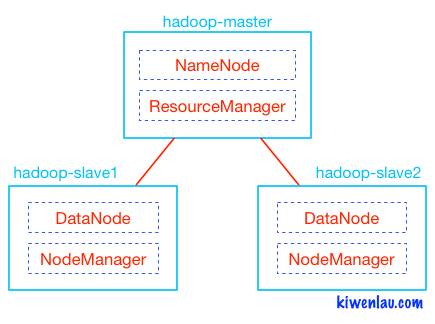

## Run Hadoop Cluster within Docker Containers
- This project has been repaired several bugs from its original source and been tested stably in Ubuntu 20.04 x86_64.



### install docker

[Ubuntu 18.04](https://cloud.tencent.com/developer/article/1619824 "ubuntu 18.04")

[Ubuntu 20.04](https://zhuanlan.zhihu.com/p/142034323 "ubuntu 20.04")

### 3 Nodes Hadoop Cluster


##### 1. clone github repository

```
git clone https://github.com/crazyn2/hadoop-zookeeper-hbase.git
cd hadoop-zookeeper-hbase
```

##### 2. build docker image or pull re-build image

```
chmod +x build-image.sh
./build-image.sh
```
or
```
docker pull ctazyn/hadoop-hbase:2.0
```


##### 3. create hadoop network

```
sudo docker network create --driver=bridge hadoop
```

##### 4. start container

```
chmod +x ./start-container.sh
./start-container.sh
```

**output:**

```
start hadoop-master container...
start hadoop-slave1 container...
start hadoop-slave2 container...
root@hadoop-master:~# 
```
- start 3 containers with 1 master and 2 slaves
- you will get into the /root directory of hadoop-master container

##### 5. start hadoop

```
./start-hadoop.sh
```

##### 6. run wordcount

```
./run-wordcount.sh
```

**output**

```
input file1.txt:
Hello Hadoop

input file2.txt:
Hello Docker

wordcount output:
Docker    1
Hadoop    1
Hello    2
```

### Arbitrary size Hadoop cluster

##### 1. pull docker images and clone github repository

do 1~3 like section A

##### 2. rebuild docker image

```
sudo ./resize-cluster.sh 5
```
- specify parameter > 1: 2, 3..
- if the parameter is null, the default is 3
- this script just rebuild hadoop image with different **slaves** file, which pecifies the name of all slave nodes


##### 3. start container

```
sudo ./start-container.sh 5
```
- use the same parameter as the step 2

##### 4. run hadoop cluster 

do 5~6 like section A

##### 7. run hbase
```
/usr/local/hbase/bin/start-hbase.sh
```
Warning：please wait at least 3 min until the application launches successfully


##### 8. start hbase shell
```
/usr/local/hbase/bin/hbase shell
``` 
### stop docker cluster
```
chmod +x stop-docker.sh
./stop-docker.sh
```
### start docker cluster after stopped the cluster
```
chmod +x start-docker.sh
./start-docker.sh

```
[ResourceManager](http://127.0.0.1:8088)
[NameNode](http://127.0.0.1:50700)
[Hbase](http://127.0.0.1:16010)
[Mapreduce](http://127.0.0.1:19888)
## Development with VScode + Maven + Java11 + Docker

## Referece Blogs
- Blog: [Run Hadoop Cluster in Docker Update](http://kiwenlau.com/2016/06/26/hadoop-cluster-docker-update-english/)
- 博客: [基于Docker搭建Hadoop集群之升级版](http://kiwenlau.com/2016/06/12/160612-hadoop-cluster-docker-update/)
- 博客: [基于docker快速搭建hbase集群](https://www.cnblogs.com/xiao987334176/p/13230925.html)