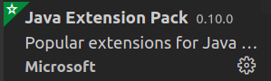
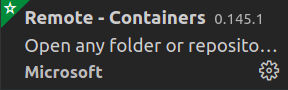

## Run Hadoop Cluster within Docker Containers
- This project has been repaired several bugs from its original source and been tested stably in Ubuntu 20.04 x86_64.


### install docker

[Ubuntu 18.04](https://cloud.tencent.com/developer/article/1619824 "ubuntu 18.04")

[Ubuntu 20.04](https://zhuanlan.zhihu.com/p/142034323 "ubuntu 20.04")

### 3 Nodes Hadoop Cluster


##### 1. clone github repository

```bash
git clone https://github.com/crazyn2/hadoop-zookeeper-hbase.git
cd hadoop-zookeeper-hbase
```

##### 2. build docker image or pull re-build image

```bash
chmod +x build-image.sh
./build-image.sh
```
or
```bash
docker pull ctazyn/hadoop-hbase:latest
```
- ctazyn/hadoop-hbase:1.0 :ubuntu14.04 + hadoop2 + zookeeper3 + hbase1 + openjdk8
- ctazyn/hadoop-hbase:2.0 :ubuntu18.04 + hadoop2 + zookeeper3 + hbase1 + openjdk8
- ctazyn/hadoop-hbase:2.1 :ubuntu18.04 + hadoop3 + zookeeper3 + hbase1 + openjdk11(2.1 or later the openjdk is 11)
- ctazyn/hadoop-hbase:2.2 :ubuntu20.04 + hadoop3 + zookeeper3 + hbase1 + mariadb + hive3 + openjdk11
- ctazyn/hadoop-hbase:2.3 :hadoop3 + zookeeper3 + hbase1 + openjdk11(mariadb + hive3 just in hadoop-master container to simplify the image disk occupation)
- ctazyn/hadoop-hbase:latest(repair several bugs and enhance security level)(recommanded)
- ctazyn/hadoop-spark-hbase:latest(just append spark frame)(recommanded)
##### 3. create hadoop network

```bash
sudo docker network create --driver=bridge hadoop
```

##### 4. start container

```bash
chmod +x ./start-container.sh
./start-container.sh
```

**output:**

```bash
start hadoop-master container...
start hadoop-slave1 container...
start hadoop-slave2 container...
root@hadoop-master:~# 
```
- start 3 containers with 1 master and 2 slaves
- you will get into the /root directory of hadoop-master container

##### 5. start hadoop

```bash
./start-hadoop.sh
```

##### 6. run wordcount

```bash
./run-wordcount.sh
```

**output**

```bash
input file1.txt:
Hello Hadoop

input file2.txt:
Hello Docker

wordcount output:
Docker    1
Hadoop    1
Hello    2
```

### Arbitrary size Hadoop cluster

##### 1. pull docker images and clone github repository

do 1~3 like section A

##### 2. rebuild docker image

```bash
sudo ./resize-cluster.sh 5
```
- specify parameter > 1: 2, 3..
- if the parameter is null, the default is 3
- this script just rebuild hadoop image with different **slaves** file, which pecifies the name of all slave nodes


##### 3. start container

```bash
sudo ./start-container.sh 5
```
- use the same parameter as the step 2

##### 4. run hadoop cluster 

do 5~6 like section A

##### 7. run hbase
```bash
/usr/local/hbase/bin/start-hbase.sh
```
Warning：please wait at least 3 min until the application launches successfully


##### 8. start hbase shell
```bash
/usr/local/hbase/bin/hbase shell
``` 
### stop docker cluster
```bash
chmod +x stop-docker.sh
./stop-docker.sh
```
### start docker cluster after stopped the cluster
```bash
chmod +x start-docker.sh
./start-docker.sh

```
[ResourceManager](http://127.0.0.1:8088)

[NameNode in hadoop2](http://127.0.0.1:50700)

[NameNode in hadoop3](http://127.0.0.1:9870)

[Hbase](http://127.0.0.1:16010)

[Mapreduce](http://127.0.0.1:19888)
```
mapred --daemon start historyserver
```
## Solve the problem
### Complete state
```bash
root@hadoop-master:/usr/local/hadoop/logs# jps
2148 Jps
22 QuorumPeerMain
1832 ResourceManager
248 NameNode
476 SecondaryNameNode
```
### Start ResourceManager manually
```bash
start-yarn.sh
```
### Start DFS manually
```bash
start-dfs.sh
```
## Development with VScode + Maven + Java11 + Docker
- VScode plugins:Java Extension Pack(Microsoft), Docker(Microsoft), Remote Explorer(Microsoft)



##### 1.maven build java project directory
```bash
mvn archetype:generate "-DgroupId=com.companyname.bank" "-DartifactId=consumerBanking" "-DarchetypeArtifactId=maven-archetype-quickstart" "-DinteractiveMode=false"
```
##### 2.VScode connect hadoop-master of docker container by Docker and Remote Explorer plugins
click Remote Explorer plugin icon which is in the left extension volumn and right click the expected container "attach the container" chioce.
Then please wait for a while until the VScode remote server applications is installed.By the way, if the Java Extension Pack plugin remote server isn't installed, you should finish it manually which automatically builds settting.json and launch.json in docker container.
##### 3.Open folder in VScode
##### 4.Build jar file in target directory
```bash
mvn package
```
##### 5.Run jar file in hadoop
```bash
hadoop jar {filename}.jar {mainClassPath}
```
Example
``` bash
hadoop jar consumerBanking-1.0-SNAPSHOT.jar com/companyname/bank/App
```
### Run docker container which is composed by hadoop-spark
container: ctazyn/hadoop-spark-hbase:latest(Ubuntu20.04+hadoop3.3+spark3)
##### 1.Download container
```sh
docker pull ctazyn/hadoop-spark-hbase:latest
```
Then the similar shell scripts whose name is inserted into spark
### Error repair manually
##### 1.ERROR: Can't get master address from ZooKeeper; znode data == null
This error is caused by failed zookeeper processs.Sometimes, the zookeeper couldn't be launched by start-all.sh shell script, but the hbase is still launched which is based on zookeeper.

Solution:

Restart the cluster by running stop-docker.sh and start-docker.sh, then start zookeeper service manunally by bashing start-yarn.sh, finally launch hbase processs justing executing start-hbase.sh
##### 2.ERROR:Caused by: org.apache.hadoop.ipc.RemoteException(org.apache.hadoop.hbase.TableExistsException):{tableName}
Caused:

Rebuild docker container named hadoop-master  after import data into hbase and run java project again.

Solution:

Delete other hbase nodes by zookeeper-cli or rebuild the docker cluster
## Referece Blogs
- Blog: [Run Hadoop Cluster in Docker Update](http://kiwenlau.com/2016/06/26/hadoop-cluster-docker-update-english/)
- 博客: [基于Docker搭建Hadoop集群之升级版](http://kiwenlau.com/2016/06/12/160612-hadoop-cluster-docker-update/)
- 博客: [基于docker快速搭建hbase集群](https://www.cnblogs.com/xiao987334176/p/13230925.html)